<p align="center">
  
</p>

<h1 align="center">Cosmical</h1>

<p align="center">
An Obsidian theme created to enhance the note taking experience. It balances color use inspired by coding editors and a neutral background to keep things balanced
</p>


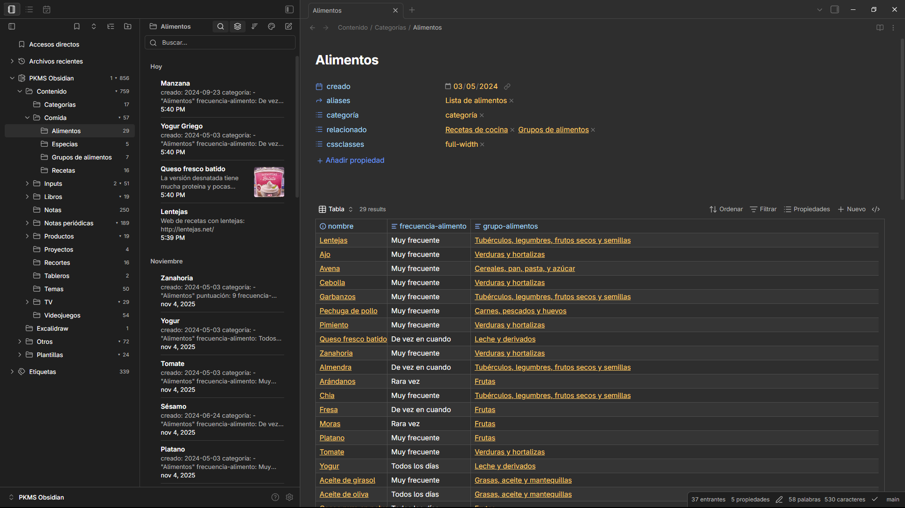

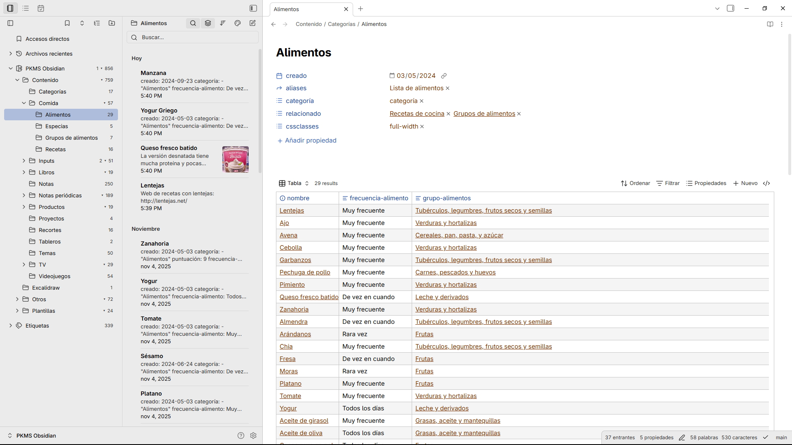

> **Important**: Cosmical ignores the user accent color and uses it's own color-scheme, you need to install the "[Style Settings](https://github.com/mgmeyers/obsidian-style-settings)" community plugin in order to select a diferent color-scheme.

## Theme

My main goal with Cosmical is to make Obsidian look more atractive while maintaining focus and not adding distractions.

Two main features:

-   A neutral background inspired by Gnome
-   Rich accents and vibrant colors inspired by coding editors

The plugin [Style Settings](https://github.com/mgmeyers/obsidian-style-settings) is needed to pick a different subtheme.

## Color Schemes

### Ocean (Default)

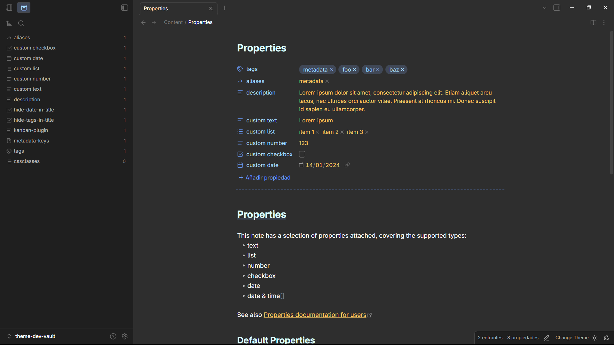
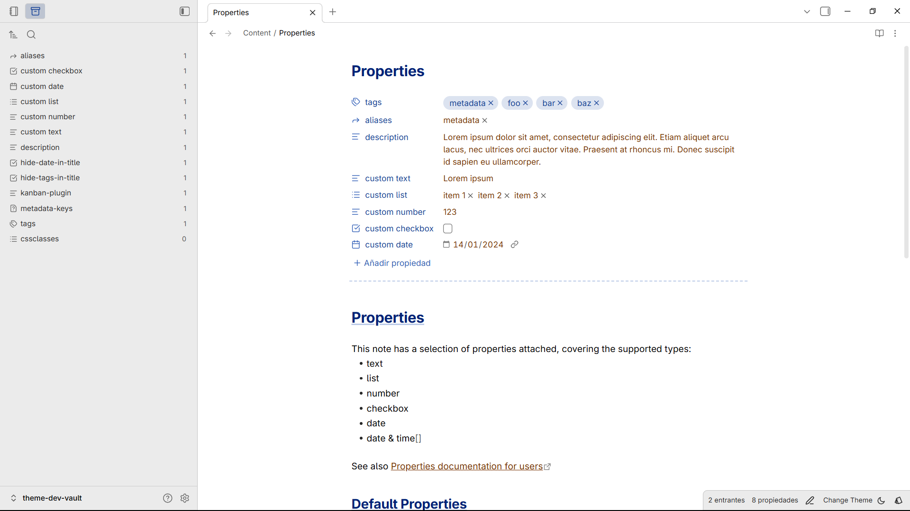

### Forest

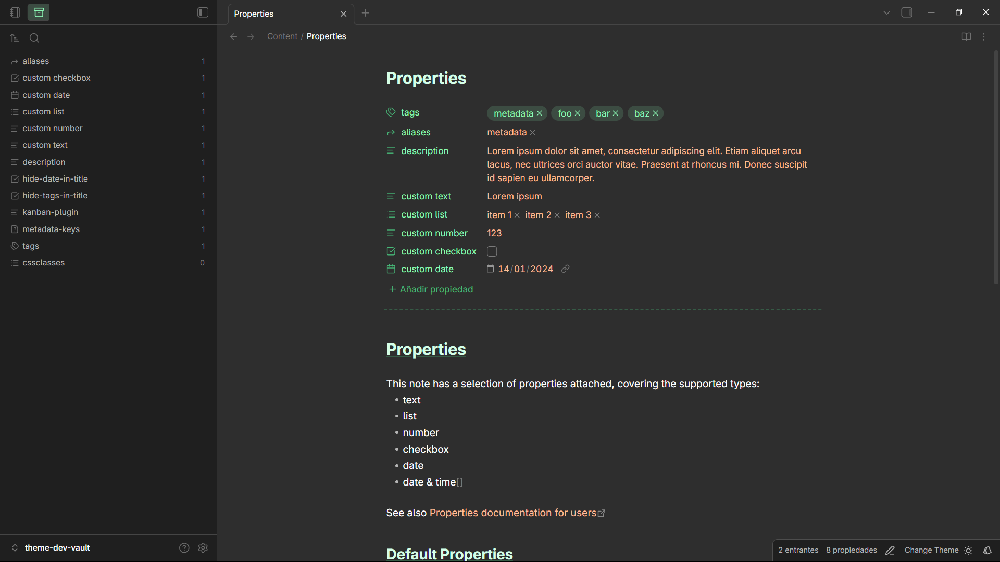
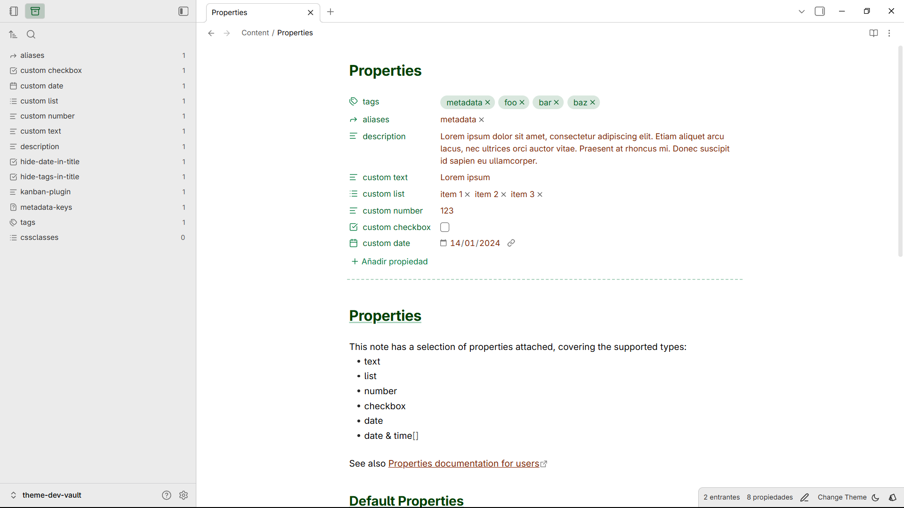

### Twilight

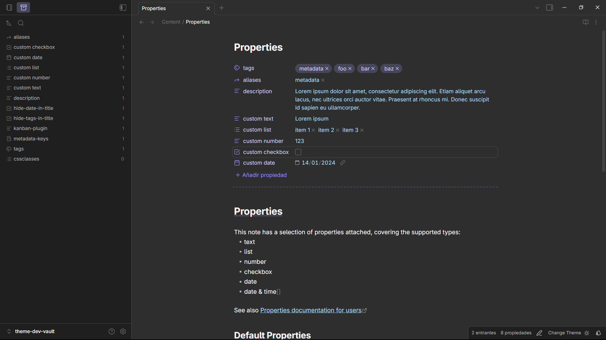


### Sunset

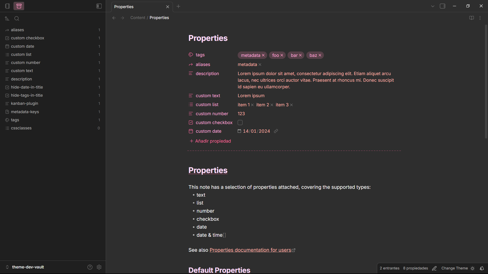
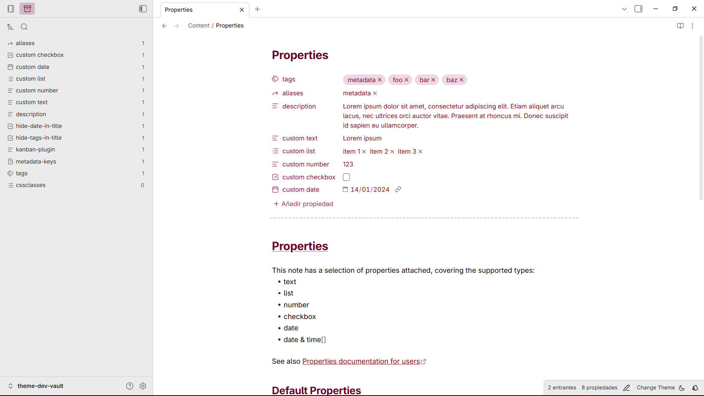

### Night

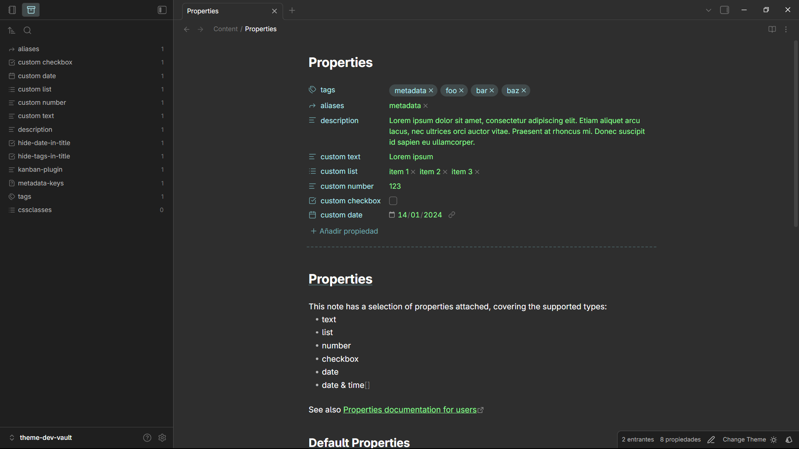
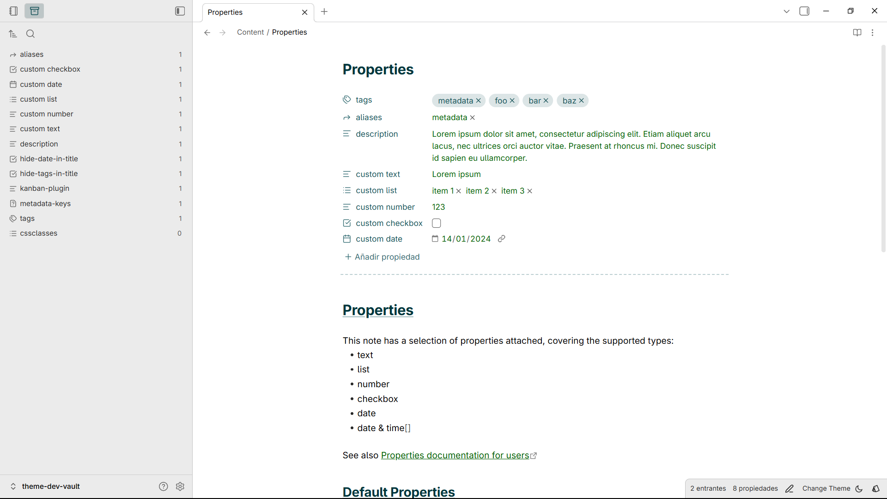

## Snippets

Small features you can toggle on/off:

-   Colored headings (with optional underlines)
-   Hide or customize file titles
-   Control sidebar toggle button visibility
-   Improved multi-select list UX

## Installation

### Community themes (recommended)

1. Open Obsidian Settings
2. Navigate to **Appearance** → **Themes**
3. Click **Browse** and search for "Cosmical"
4. Click **Install**

### Manual

1. Open your system File explorer
2. Navigate to the root folder of your vault
3. Open ".obsidian/themes"
4. Create new folder "Cosmical" and open it
5. Copy manifest.json and theme.css
6. Cosmical should now appear as an installed theme

## Development

I used Vite + PostCss to help with the development workflow. I created this based on a legacy theme I had and divided it into different files to help with the chaos.

### Commands

The `theme.css` is minified automatically

Setup

```bash
npm install
```

Automatic rebuilds

```bash
npm run dev
```

Build

```bash
npm run build
```

## Contributing

You can send suggestion using [open an issue](https://github.com/M-Torrus/cosmical-obsidian/issues).

## License

This theme is released under the Apache License 2.0. See [LICENSE](LICENSE) for details.

## Other

Checkout my other theme for Visual Studio Code [VSCode-Cosmical](https://marketplace.visualstudio.com/items?itemName=jorgemrtr.cosmical)
